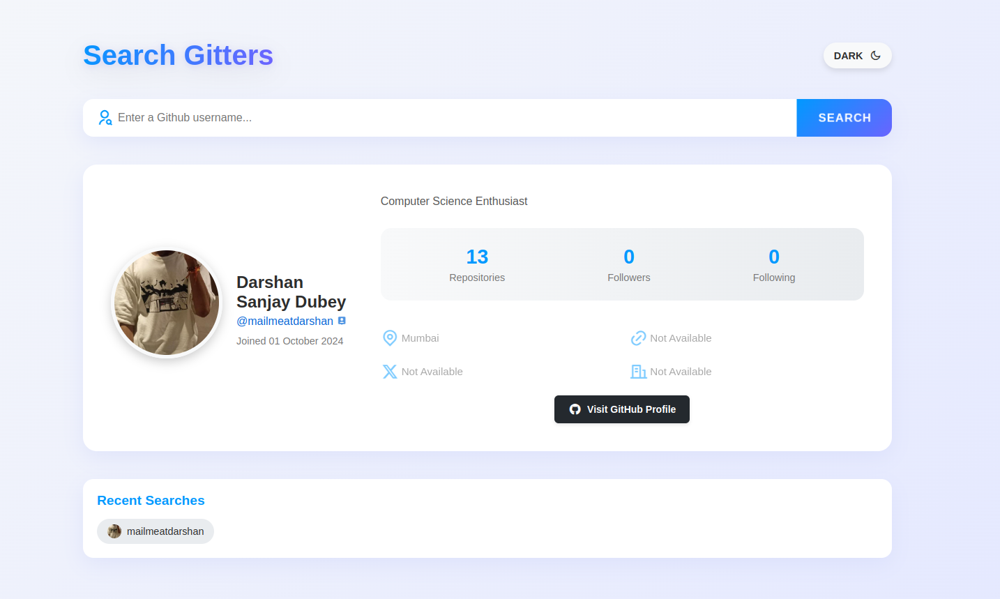
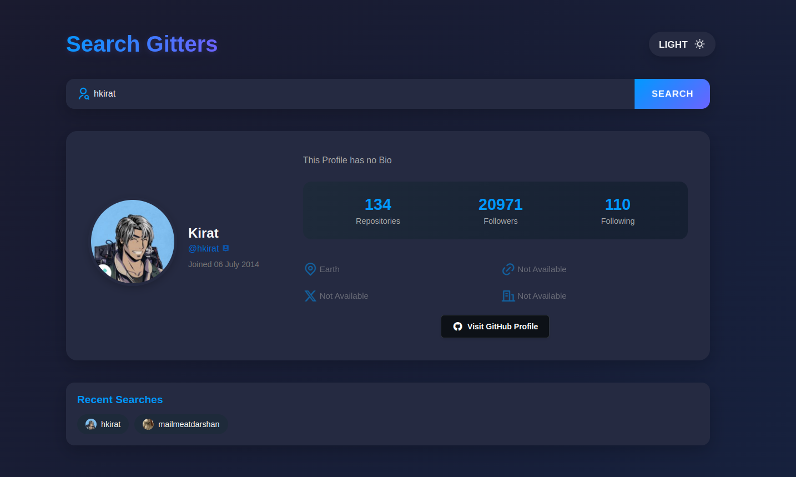

# 🚀 Gitters | GitHub Profile Explorer

<div align="center">


</div>

<p align="center">✨ <strong>Discover GitHub users in style. Beautiful, fast, and intuitive.</strong> ✨</p>

## ✨ Features

- **⚡ Lightning Fast** - Get profile information instantly
- **🌗 Dark/Light Mode** - Toggle between themes with one click
- **🔍 Powerful Search** - Find any GitHub user with ease
- **📊 Profile Stats** - View repositories, followers, and more
- **📱 Responsive Design** - Works perfectly on all devices
- **📜 Search History** - Quick access to recently viewed profiles
- **🔗 Direct Links** - Jump to repositories, followers, and more

## 🖥️ Preview

<div align="center">
  

  
</div>

## 🛠️ Built With

- HTML5
- CSS3
- Vanilla JavaScript
- [GitHub API](https://docs.github.com/en/rest)
- [Remix Icons](https://remixicon.com/)

## 🚀 Getting Started

### Prerequisites

- A modern web browser(Chrome, Brave, Edge)
- Internet connection

### Installation

1. Clone the repository:
   ```bash
   git clone https://github.com/mailmeatdarshan/gitters.git
   ```

2. Navigate to the project directory:
   ```bash
   cd gitters
   ```

3. Open `index.html` in your browser or use a local server:
   ```bash
   # Using Python
   python -m http.server
   
   # Using Node.js and npx
   npx serve
   ```

## 📖 How to Use

1. **Search for a User**: Type a GitHub username in the search box and press Enter or click the Search button.
2. **View Profile Details**: Instantly see profile picture, bio, stats, and social links.
3. **Toggle Theme**: Switch between dark and light mode using the theme toggle in the header.
4. **Access GitHub**: Click on the username or "Visit GitHub Profile" button to view the profile directly on GitHub.
5. **Quick Access**: Use the recent searches section to quickly access previously viewed profiles.


## 🌟 Why Gitters?

- **✅ No Dependencies** - Pure vanilla JavaScript with zero dependencies
- **✅ Clean Design** - Modern, minimal interface inspired by GitHub
- **✅ Performance First** - Optimized for speed and efficiency
- **✅ Developer Friendly** - Well-structured, commented code for easy customization

## 📝 License

This project is licensed under the MIT License - see the [LICENSE](LICENSE) file for details.


## 📬 Contact

Darshan Dubey - [main.darshan](https://www.instagram.com/main.darshan/) - mailmeat@gmail.com

Project Link: [gitters](https://github.com/mailmeatdarshan/gitters)

---

<div align="center">
  <p>Made with ❤️ by <a href="https://github.com/mailmeatdarshan">Darshan Dubey</a></p>
  <p>⭐ Star this project if you found it useful! ⭐</p>
</div>

---